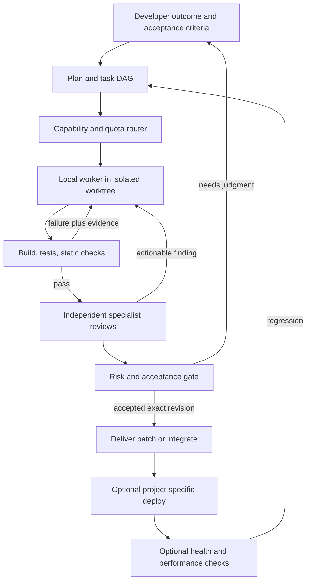

# Architecture and product contract

## Purpose

Build a reusable coding harness for Sasha's personal projects. Pi provides the initial model/session engine; experimental native Claude Code and Codex adapters supply bounded CLI runtimes for durable tasks. This repository owns task selection, worker lifecycles, local evidence, model routing, and acceptance decisions. Keep orchestration, source, and coordination on the developer machine. Inference still contacts the selected AI providers; “local” does not mean offline model inference.

The supplied workflow diagram is inspiration, not an instruction to integrate Slack, Notion, or OpenAI internal systems. The [article's accessible introduction](https://newsletter.pragmaticengineer.com/p/openai-software-factory) describes automated engineering feedback loops. The full paid article was not available in this session. This design adapts the user-supplied diagram independently.

## Alpha distribution and UI

The private local Pi package ships extension source, compiled worker entrypoints, configuration skills and required Python helpers. Each installation owns production dependencies resolved from the included release lock. Project settings and journals are excluded. Interactive command progress is a read-only footer with lifecycle-fenced cleanup; orchestration remains in the durable engine. See [release scope](release-alpha.md).

## Target workflow (planned)

A deterministic local supervisor and SQLite event ledger coordinate persistent goals independently of model availability. An optional local LLM may advise on ambiguous failures, but scheduling and policy enforcement must work without inference. See [persistent goals and memory](goal-supervisor.md). The ledger replaces chat tools as the coordination mechanism. Files hold specifications, decisions, diffs, check logs, and review findings. The developer gets one local interface and can steer or cancel runs. GitHub is an optional publishing adapter, not a dependency for the local loop.

For an implementation-grounded walkthrough of ensemble routing, recovery and remaining work, see [current ensemble architecture](ensemble-current.md).

## First slice (implemented; legacy swarm mode)

- Strict JSON task and candidate schemas; reject unknown fields and duplicate IDs.
- A deterministic router selects the lowest configured quality tier meeting a task's floor, then preference. It selects the lowest supported effort at or above the request. These are user-supplied policy tiers, not measured intelligence scores.
- Explicit provider constraints enable independent perspectives. Without constraints, multiple tasks may choose the same model; provider diversity is not automatic.
- A bounded pool preflights all policy routes and retains results in task order. Failures are isolated and are not retried.
- Pi sessions execute explicitly supplied prompts without tools, extensions, project context, skills, or prompt templates. Authentication remains in Pi's credential store. The adapter checks the active auth type and rejects known incompatible billing configurations.
- A per-prompt deadline settles the local worker, requests Pi cancellation, and disposes the session. It is not a hard process kill and cannot guarantee that remote inference stops billing immediately. The request and final batch report are saved locally by the CLI.

## Decisions for the next slices

**Compose Pi; do not fork it.** Keep orchestration separate from provider protocol details. Pi already exposes provider switching, model catalogs, reasoning levels, sessions, and extension points. Its example subagent implementation means spawning agents is not novel; reliable lifecycle and evidence management is the actual work here.

**Separate execution adapters from billing.** Prefer Pi-native provider access where suitable. Use a native Claude Code worker for the user's Claude subscription. Anthropic's current notice preserves CLI/Agent SDK subscription usage; see docs/providers.md for the correction and source. The experimental adapter returned a correct live result; included-only billing is not established by login status, so execution requires explicit metered authorization pending a verified included-only control. Keep native CLI authentication and process lifecycle separate from Pi's direct Anthropic provider. Model access must be discovered and verified per account; never rename or substitute a requested model silently. Muse, Kimi, MiniMax and others are optional integrations after their exact product, endpoint, and access mode are established.

**Recover the task independently of its session.** Add native Codex workers alongside Pi and Claude Code, and route by verified tool capabilities. Persist checkpoints outside provider transcripts; use bounded, authorized model/provider fallback for recoverable failures. Computer-use capability must be discovered and its shared desktop access serialized. See [native workers and recovery](recovery.md) for failure classification, handoff transactions, and acceptance tests.

**Route before spending.** Keep model tier, reasoning effort, quota headroom, concurrency, latency, and dollar budget separate. Unknown quota is unknown, not unlimited. Exhausted subscriptions should pause or select an explicitly permitted alternative; never quietly enable API billing. Escalation should be bounded and evidence-driven. Preserve a strong minimum tier for ambiguous, security-sensitive, or architectural work. Evaluate routing against completed tasks before treating the policy as optimal.

**Parallelize independent work.** Use fan-out for brainstorming and independent reviews; synthesize into one decision artifact. Reviewers receive the same revision and evidence but not each other's conclusions initially. Agreement does not substitute for deterministic checks. Start coding with one writer per task worktree; branches isolate changes, but do not sandbox shell access. Actual execution isolation and an allowed-command policy are separate requirements.

**Make loops finite and resumable.** Each run needs a task DAG, durable state transitions, leases, attempts, deadlines, cancellation, token/usage observations, and cost ceilings. A fix invalidates previous checks and reviews. Accept only the exact revision that passed. Bound worker attempts; retain the goal durably on no progress, missing access, exhausted resources, or unresolved findings. Persist a scheduled retry, event trigger, or actionable blocker. User-defined budgets and deadlines remain binding. Complete only after verification, or close on explicit cancellation/supersession.

**Offload execution, not the control plane.** Only offload after measuring CPU, memory, disk, GPU or test-runtime pressure. First remote adapter should execute a reproducible build/test job over SSH; add AWS Spot after checkpointing, interruption recovery, maximum instance lifetime, budget enforcement and cleanup are demonstrated. Avoid sending subscription credentials to remote workers when they only need to compile or test. No AWS resources are created by the first slice.

**Delegate authority explicitly.** User goals and trusted project policy define work. Retrieved documents, dependency text, test output, and peer-agent answers are evidence. They cannot authorize new tools, spending, publishing, or destructive actions. Future tool-enabled workers must enforce permissions outside model prompts.

## Success criteria

The useful MVP starts from an outcome in another personal repository, creates an isolated change, passes that repository's checks, obtains independent reviews across two providers, repairs an injected defect, survives interruption, and produces a reviewable patch with an exact-revision evidence bundle. It must demonstrate a simple subtask routed to a smaller model and stop cleanly when included quota is unavailable.

Only after that should we add autonomous integration/deploy and production monitoring from the inspiration diagram. Local orchestration does not require a full observability platform, communication SaaS, or a cloud scheduler.

## Local inference adapter

Implemented: `relentless-local/qwen3.5-4b` uses the public Pi custom-provider API with an isolated empty credential store and fixed loopback endpoint. Local billing does not require metered access. The adapter is a tool-free, single-worker inference route used by both the legacy swarm and the durable supervisor. Exact runtime/model pins and server lifecycle are in [local inference](local-inference.md).

## Durable supervisor — implemented tool-free scope

`goal` commands use SQLite WAL/FULL commits, a hashed checkpoint, events, fenced supervisor leases, committed dispatch intents and isolated Pi child processes. Contracts carry dependencies, output predicates, budgets, route restrictions and sourced memories. Retry/cooldown timestamps persist across restarts; blocked branches do not stop independent work. See [durable operations](durable-operations.md) for the supported contract, exact failure semantics and service/backup lifecycle. Native coding/desktop workers are not enabled by this change.

## Bounded coding adapter

A separate `relentless code` command now uses process-isolated inference and host-controlled replacement edits to explicitly listed files in a private copy. Fixed syntax/JSON and optional required-export declaration checks can feed failures back within an attempt budget. It exports hashed changes for review; it does not execute project code or apply changes to the original. The additional `coding create/resume/status/cancel/revise` path persists frozen sources and cumulative attempts in a separate SQLite journal. Fenced lease epochs reject stale commits, and terminal resumes reconstruct exports. It now supports per-run provider cooldowns, durable retry timestamps and constrained fallback. Issued-attempt provenance preserves blocking denials across lease takeover. Explicit versioned prompt updates preserve budgets and invalidate review candidates. Provider cooldowns are now shared across coding runs in the same project journal. Broader constraint revision and goal-ledger integration remain unconnected. See [coding workers](coding-workers.md).

## Measured routing increment

Optional task optimization uses exact workload/suite/billing/effort observations after hard eligibility and durable cooldown filtering. Host evaluations emit checked outcomes and latency; known metered cost estimates remain distinct from invoiced cost. Per-case acceptance and optional sample/lower-bound requirements prevent pooled successes from masking weak cases. Insufficient evidence blocks requested optimization. See [model efficiency](model-efficiency.md) and the active [self-improvement program](self-improvement-program.md).

Read-only `inventory` now separates candidate enablement, catalog presence, authentication presence, configured billing allowance, Pi-advertised efforts and ledger cooldowns. Capacity remains explicitly unverified. It does not automatically broaden routes. See [inventory](model-inventory.md).

## Behavioral execution prerequisite

Automatic coding verification still uses only fixed host syntax checks; explicit VM experiments are described below. A dedicated no-host-mount Colima/VZ probe failed because virtualization is unavailable in the current execution environment; its temporary runtime was removed. [Execution isolation status](execution-isolation.md) records evidence and requirements for a future backend. This limitation does not authorize a fallback to unrestricted project commands.

Inventory now reads both local health sources without inference or journal mutation. Their reporting union is observational; goal/coding dispatch integration remains pending.

`coding review` now dispatches two preflighted, non-author provider routes against the same saved candidate and exports structured findings bound to its checkpoint hash. This is evidence collection, not automatic acceptance or integration; review recovery and behavioral verification remain pending.

Coding checkpoints can now carry bounded, versioned project requirements and background facts. The same saved context reaches coding workers and reviewers; context updates invalidate review evidence without changing execution authority. Automatic project/session memory ingestion remains pending.

Persisted coding/review orchestration is now available through `workflow create/resume/status`: bounded repairs, reserved review-pair budgets, quota waits and crash reconciliation. It stops at `verification_required`; unattended wakeups, isolated behavioral tests and automatic integration remain pending. See [coding workflow](coding-workers.md).

Evaluations now checkpoint completed observations and reserve dispatches in SQLite. `evaluation status/resume <directory>` preserves contracts, call limits and deadlines; ambiguous in-flight calls are not automatically replayed. Scheduled retries and operator reconciliation remain unfinished.

`workflow run <coding-id>` now supplies a cancellable foreground retry loop for coding/review workflows, preserving saved budgets and stopping at blockers or verification. Enabled Alibaba Personal routes are excluded from this unattended path. No workflow service is installed; interrupted-review reconciliation and behavioral execution remain pending.

Cycle 022 established a bootable local QEMU TCG isolation prototype with fixed unprivileged resource-fault diagnostics. It avoids the earlier VZ limitation, but project behavioral execution remains disabled until the pinned runtime and verification protocol are implemented and validated. See [execution evidence](execution-isolation.md).

Cycle 023 ran pinned Node 24.21.0 and three fixed tests of the reviewed Relentless scheduler inside QEMU, with a separate privileged result channel and source/test hash checks. This supervised prototype is now accessible through the experimental prepared-image command described below; automatic project verification remains unfinished. See [execution evidence](execution-isolation.md).

Cycle 024 adds `verify-vm run/status`: a reusable supervisor for reviewed, prepared images with pinned private snapshots, bounded execution, protected result validation and durable terminal/ambiguous records. It reports execution evidence with acceptance explicitly unassessed. Source-to-image packaging, acceptance-oracle integration, host-memory enforcement and interrupted-run reconciliation remain pending. See [execution evidence](execution-isolation.md).

Cycle 025 adds `verify-vm package`: deterministic multi-file source/test overlays, an explicit test entrypoint, protected bundle digests and before/after file checks. Reviewed base images are still required. Cycle 026 adds `workflow package` to select the exact reviewed journal checkpoint and bind its source/specification hashes; Cycle 027 adds `workflow verify` with an explicit test-process exit rule and checkpoint-bound assessment. Cycle 028 consumes assessments into durable `verified`/repair states, preserves budgets, and reconciles completed assessments without replay. Cycle 029 adds explicit recoverable source promotion from verified checkpoints; see [promotion contract](source-promotion.md). Automatic orchestration and broader goal-ledger/routing integration remain pending. See [packaging contract](execution-isolation.md#reusable-source-and-test-packaging--cycle-025).

Cycle 030 adds a local Pi package with explicit status/resume commands over the
same engine, and a Relentless-authored optional verification continuation callback.
Full CLI verification orchestration and Pi lifecycle controls remain pending.
See [Pi package architecture and setup](pi-package.md).

Cycle 031 adds Pi-scoped role route previews, shared local-provider registration
and pre-dispatch checks on actual Pi workflow resume. Automatic goal creation,
policy migration and full Pi session lifecycle integration remain pending; see
[role routing contract](pi-package.md#role-routing-and-dispatch-scope--cycle-031).

Cycle 032 connects normal Pi session shutdown/reload to command admission,
workflow cancellation and stale UI suppression. Crash recovery remains incomplete:
expired coding leases can still authorize another bounded attempt without proof
of prior remote termination. See [lifecycle limits](pi-package.md#pi-session-lifecycle--cycle-032).

Cycle 033 prevents automatic inference takeover on coding-lease expiry. Expired
runs become ambiguous without new spend; workflows block and retain provenance.
Explicit evidence-based reconciliation remains pending. See [coding ambiguity](coding-workers.md#ambiguous-expired-dispatches--cycle-033).

Cycle 034 adds snapshot-hashed targeted text edits to both coding runners. A live
large-file golden case used a 290-byte reply and preserved the complete expected
source. Broader measured role calibration and ambiguous-outcome reconciliation
remain pending. See [targeted edit boundaries](coding-workers.md#targeted-edits--cycle-034).

Cycle 035 adds explicit Pi-native coding/workflow creation from project roles,
current catalog/scope and task constraints, without inference. Frozen policy and
per-author independent-review preflight are implemented. Atomic/idempotent creation
recovery, full goal orchestration and automatic capability calibration remain
pending. See [creation contract](pi-package.md#creating-work-inside-pi--cycle-035).

Cycle 036 makes new Pi task creation idempotent by task ID. Source and review
intent commit together; repeated creation attaches the workflow under a checkpoint
fence or preserves its progressed state. SIGKILL and concurrent-creation tests
cover commit-boundary recovery. Legacy migration, storage-initialization recovery
and automatic goal/calibration orchestration remain unfinished. See
[creation recovery](pi-package.md#idempotent-creation-recovery--cycle-036).

Cycle 037 connects explicit completed local evaluation journals to Pi route
previews and creation policy. It preserves host-assessed failures, deduplicates
trial IDs and rejects incomplete/ambiguous sources without importing permissions.
Automatic coding-suite calibration and the complete goal loop remain pending.
See [evidence loading](pi-package.md#local-evaluation-evidence--cycle-037).

Cycle 039 adds fenced durable coding-attempt latency and metered estimate
telemetry, retaining unknown cost and legacy checkpoint hashes. These measurements
do not grant acceptance or capability credit. Verified coding-outcome attribution,
failed-trial accounting and automatic calibration remain pending. See
[measurement boundaries](coding-workers.md#durable-attempt-measurements--cycle-039).

Cycle 041 adds `/relentless calibration-plan <suite-json>` as a read-only Pi command.
It derives coding/review eligibility from project roles and Pi model scope, binds
prospective source/test/runtime pins and budgets, and enumerates every declared
model/case/repetition slot. It neither verifies artifact bytes nor persists or
dispatches trials. Durable reservations, execution admission and complete verified
coding-outcome accounting remain next. See [calibration preview](pi-package.md#prospective-coding-calibration-preview--cycle-041).

Cycle 042 adds atomic cohort persistence, immutable trial identity reservations
and Pi creation/offline status commands. SIGKILL and competing-process tests cover
commit recovery. The calibration execution adapter, pinned-input verification and
verified outcome admission remain next; reservation is not dispatch or acceptance.
See [durable calibration cohorts](pi-package.md#durable-calibration-cohorts--cycle-042).

Cycle 043 connects saved trial reservations to coding workflows through Pi.
Preparation verifies declared input pins, preserves exact author/budget assignment,
and reuses atomic creation/attachment recovery. It does not execute the cohort or
admit observations; verified receipt attribution and complete trial outcome
accounting remain next. See [trial preparation](pi-package.md#preparing-coding-trials--cycle-043).

Cycle 044 adds explicit Pi calibration-step execution through coding, independent
review and the frozen VM contract, including bounded repair. Existing verification
directories are reconciliation-only; session cancellation reaches the supervisor.
Automatic cohort scheduling and complete outcome/cost admission remain next.
See [trial advancement](pi-package.md#advancing-a-trial--cycle-044).

Cycle 045 adds read-only accounting for every planned calibration slot and
provenance-checked author-only telemetry. Pending/ambiguous/failed work remains
visible; verified states are explicitly unadmitted and no routing observations
are emitted. Complete workflow metrics and verified admission remain next.
See [cohort accounting](pi-package.md#cohort-accounting--cycle-045).

The Pi package now includes the discoverable `relentless-configure` skill for model
discovery, task-specific role proposals and exact configuration diffs reviewed by
the user. It uses the existing project settings namespace and separates permission,
availability and measurements. This is an agent-guided workflow; automatic
background discovery and a runtime-enforced configuration approval transaction
remain future work. See [the skill](../skills/relentless-configure/SKILL.md).

Cycle 046 adds explicit verified coding-cohort admission and opt-in
`relentless.evidence.calibrations` references. Complete-cohort failed slots and unknown
metrics are retained; successful slots require independent reviews and bound VM
proofs. Fenced checkpoint checks prevent stale admission commits, and loading
revalidates evidence without importing permissions. The prospective protocol measures
author attempts only. Live representative cohorts, full-workflow accounting and
automatic scheduling remain next. See [admission](pi-package.md#verified-coding-evidence-admission--cycle-046).

Cycle 048 adds bounded validation reason codes to future review failures, while
keeping `invalid_output` as the blocking category. Diagnostics distinguish JSON,
schema, size, file and line failures without raw provider content, survive restart
and authorize no additional calls. Existing reports and frozen cohorts remain
unchanged. See [review diagnostics](coding-workers.md#structured-review-validation-diagnostics--cycle-048).

Cycle 049 exposes review and combined model-attempt accounting in read-only
calibration reports. Failed attempts remain in totals; missing reports/legacy
telemetry and unknown cost remain unknown. Known metered subtotals are labeled
separately. Full-workflow totals remain null pending complete overhead capture;
no new routing/admission metric is introduced. See
[accounting scope](pi-package.md#review-and-model-attempt-accounting--cycle-049).

Cycle 050 records optional verification timing in assessment/ workflow receipts,
separating packaging, supervisor and setup/assessment time without double-counting
the inner VM interval. Reconciliation preserves timing; broken clocks remain
unknown and do not alter acceptance. Reporting shows the latest receipt only.
Whole-workflow accounting across queue waits, repairs and incomplete operations
remains unfinished. See [timing receipts](pi-package.md#verification-timing-receipts--cycle-050).

Cycle 051 persists verification intents before packaging and retains completed
receipts across repair. Intent identity includes directory, reviewed checkpoint
and package digest; both recording and reconciliation enforce the binding.
Pending attempts remain unknown in aggregate timing. Legacy journals preserve
their old hashes until mutation and cannot acquire invented complete history.
The history is bounded to 20 reservations per workflow with no silent eviction.
Full workflow timing, scheduling and autonomous goal planning remain unfinished.

Cycle 052 isolates reviewer clock failures from review decisions and cleanup.
Reviewer attempt latency may be null; aggregate latency remains unknown if any
attempt lacks timing, without erasing separately known metered cost. Report
coverage and measurement availability are distinct.

Cycle 053 connects continuous workflow execution to verification and repair.
The journal binds an immutable execution-contract digest before verification;
per-checkpoint artifacts are reconciliation-only after intent reservation.
Pi dispatch checks and live trust checks remain active. This runs one workflow;
it does not yet connect coding jobs to the tool-free goal ledger or plan task graphs.

Cycle 054 persists a supervisor exit receipt before assessment storage. Read-only
inspection can reconstruct a missing assessment only from matching checkpoint,
execution and report digests plus the existing source/runtime/test evidence chain.
Conflicting or malformed evidence is rejected. Lost host timing remains unknown;
interruption before receipt persistence is still unresolved.

Cycle 055 separates stored OAuth presence from usable token validity. Read-only
workers reject expired/near-expiry OAuth before runtime creation; inventory exposes
only freshness metadata. The live continuous-run trial stopped at a Grok inference
error before VM execution; a later metadata check found expired OAuth. The raw
provider error was not retained, so quota or exclusive root cause is not proven.

Cycle 056 adds persisted reviewer retry waits for recognized quota/outage/model
unavailability failures only, within the original review-pair budget. Retry-After
survives in reports, and due times survive workflow reopening. Retry repeats the
review pair against the saved author checkpoint and retains failed reports. This
is not global reviewer health propagation or ambiguous-operation replay.

Cycle 057 shares persisted reviewer cooldowns across project workflows and
preflights independent pairs before reserving budget. Alternative pairs remain
constrained by the frozen routing policy and all author-provider provenance.
Legacy workflow-wide waits remain authoritative without migration. Inventory
merges read-only workflow health; unified author/goal/reviewer scheduling is still
unfinished.

Cycle 058 refreshes each reviewer route before dispatch. A newly unavailable
preselection may be replaced using the same frozen policy, excluding all author
and already-used reviewer providers. Completed assessments and actual route
accounting are retained within the reserved pair. Inference failures are not
retried by this mechanism. Without an eligible alternative, routing still blocks;
durable partial-pair waiting remains unfinished.

Cycle 059 persists partial review evidence and a retry deadline in the same pair
slot. Continuations bind to code and review-request hashes, validate static policy
and exact assessment/attempt route matches, then select only missing independent
providers. The remaining route must meet current evidence requirements; completed
assessments are not reranked at resume. Reopening never replenishes pair budget.
Resumed dispatch first records `reviewing`, retaining ambiguous-operation handling.
Partial accounting preserves known observations with incomplete aggregate totals.

Cycle 060 connects explicitly declared workflow goal tasks to Pi creation. A stable
goal/task key uses the existing atomic coding creation intent, while a revision,
contract and context binding travels with the coding checkpoint. Goal requirements
and evidence are projected separately; dependencies require current verified
outputs. Pi/goal policies are intersected and revalidated at effects and result
consumption. Workflow creation atomically binds the goal verification contract.
The text supervisor skips workflow acceptance; automatic DAG dispatch remains
missing. Explicit verified admission is described below. Promotion's mutating Python process owns goal
then coding fences, so parent death cannot permit a goal revision during writes.

Cycle 061 adds explicit verified-artifact admission. The host inspects verification
and review provenance, then atomically completes the task under goal→coding→workflow
fences held through the goal COMMIT. Receipts retain exact origin/checkpoint/spec
and file hashes; repeated admission is idempotent. Completed artifact inspection
uses that exact receipt, while dispatch still rejects completed tasks. Source
promotion remains explicit, and dependency output identifies an unapplied artifact.

Cycle 062 adds explicit goal progress synchronization from fresh fenced journals.
Optional progress records carry exact coding/workflow hashes, cumulative counters
and observed states without becoming execution authority. Revisions retain the
old origin for audit, repeated observations are idempotent, and verified admission
records final progress atomically. Coding counters and admitted task counters are
the same lineage, not additive usage. Interrupted revision transitions must first
be reconciled by workflow resume.

Cycle 063 connects best-effort progress collection to settled Pi resume and
run-verified actions. It detects bound work through an existing read-only coding
journal and delegates observation writes to the fenced sync operation. Failures
preserve the primary workflow result and expose pending progress; inactive sessions
do not collect. No periodic polling or dispatch authority is introduced.

Cycle 064 adds deterministic bounded workflow scheduling through Pi `goal-step`.
Optional acceptance work declarations fix files and the verification specification.
Stable creation preserves budgets; journal-derived waits do not starve independent
tasks. A shared goal supervisor lease and goal-first publication fences cover
author validation, review results, verification recovery and admission. Dependency
artifacts must match working-tree hashes before dependent coding starts. There is
no continuous wakeup loop, automatic source promotion or revision migration yet.

Cycle 065 adds content-bound configuration proposals and interactive Pi approval.
Application rechecks exact settings bytes, project identity and session authority,
then publishes under Pi’s cooperative settings lock with atomic file replacement.
This protects the extension command path; it neither interprets changing chat
constraints nor prevents direct filesystem edits by trusted user software.

Cycle 066 adds foreground goal execution around the fenced bounded scheduler.
The deterministic loop reads saved waits, advances ready stages and checks goal
authority during one-second timer chunks without lease/event polling. Exact
workflow snapshots bound no-progress detection. Restart resumes existing work;
there is no persisted service/autostart intent or automatic source integration.

Cycle 067 adds optional ephemeral scheduler authority to the source mutator.
The native process checks ownership under its goal lock and enforces the captured
expiry through file capture/installation. Authority stays outside the immutable
transaction so a successor can recover it. Automatic integration still needs
explicit contract intent, pre-mutation admission-grade proof checks and installed
source receipts; this fence alone does not enable it.

Cycle 068 supersedes the earlier automatic-integration limitation: workflow
tasks explicitly opting into `acceptance.work.integration: "verified"` now install
reviewed, verified existing-file changes before goal admission. Native fences pin
goal, coding and workflow evidence; installed-source receipts support recovery
after installation and before admission without another model call. Source equality
is observed at admission, not guaranteed against later editor changes. Creates,
deletes, atomic project installation, revision migration, automatic service restart
and representative full-workflow efficiency evidence remain unfinished. See
[verified installation](pi-package.md#verified-source-installation--cycle-068).

Cycle 069 adds explicit Pi session-start restart intent via project `resumeGoal`
with an exact goal ID/revision and execution-aware configuration confirmation.
Session cancellation and exact settings checks fence resumed work; the native
installer also checks settings authorization. `/relentless pause` is available while
busy. This is Pi lifecycle attachment, not an OS service or forced takeover of
draining work. Revision migration, representative calibration and measured
full-workflow efficiency remain open. See
[session restart](pi-package.md#opted-in-pi-session-restart--cycle-069).

Cycle 070 adds prospective `workflow-active-v1` calibration and `activeTime`
routing. Admitted evidence sums complete measured author, review and verification
stage durations including failures; missing stages remain unknown. This is not
wall latency or total cost, and legacy author-only observations remain unchanged.
Representative live cohorts, wall-clock accounting and total cost measurements
remain open. See [measurement semantics](model-efficiency.md#summed-measured-active-time--cycle-070).

Cycle 072 adds content-free shape diagnostics to failed review attempts: capped
UTF-8 bytes and empty/fenced/JSON-like/other/oversized output. These are observations
only, not parser repair, cause attribution, or retry authority. Existing review
validation and independent provider requirements are unchanged.

Cycle073 adds optional allowlisted worker failure origins across Pi response
handling, job execution, IPC, durable coding failures and review attempts. Job
validation, setup, inference, output limit, response handling, unsettled cancellation,
protocol faults, worker exit and observer errors remain distinct observations.
Failure kind controls recovery; diagnostic origin does not. IPC merges late faults
with already-received failures so policy denials and their origins retain priority.
Legacy journal entries omit the field and remain readable without migration.

Cycle077 extends prospective failure origins through the outer durable coding
attempt. Workspace operations, local checks, authority checks, worker inference,
output parsing and journal publication have distinct bounded labels. Existing
normalized origins win over stage fallbacks. Unsettled cancellation merges failures
by existing priority, preserving denials. Errors outside the attempt/export scope
still propagate; this is not a claim that every local error becomes a journal row.

### Managed local fallback — cycle079

Optional `routing.managedLocal` now pins and snapshots the local executable, model
and bundled libraries, starts a CPU server per authorized local call, checks
readiness and cleans up the owned process and files. Pi's configuration skill and
exact proposal confirmation cover this permission; it is absent from active
project settings. One real Pi/Qwen call passed in 14.3 seconds with confirmed
cleanup. This is lifecycle evidence, not model qualification or total-cost evidence.
See [configuration, bounds and limitations](local-inference.md#optional-managed-lifecycle--cycle079).

## Pi host compatibility

Relentless runs inside Node/npm Pi or standalone Bun Pi. A narrow SQLite adapter
normalizes native driver results and finalizes Bun statements after each
operation. Bun restores copy a SQLite snapshot into the exclusively reserved
file and fsync it before returning. The database format and checkpoint hashes
remain shared with Node and Python tooling. Forked workers, TypeScript erasure
and syntax checks use an automatically verified Node executable; standalone Pi
is never used as a worker executable. This does not remove the Node prerequisite.
