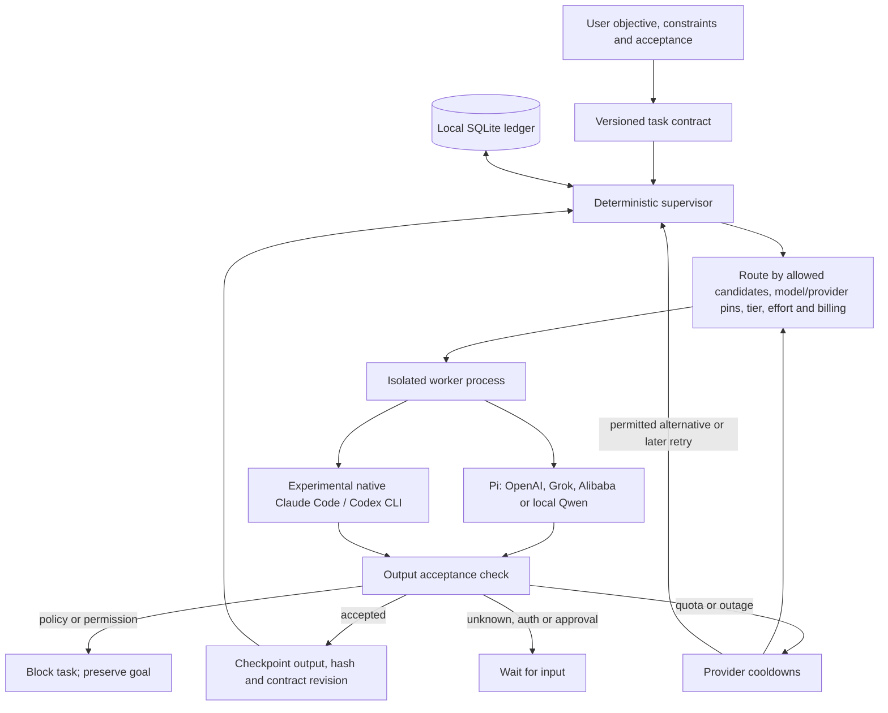

# Relentless ensemble: current implementation and next steps

## What runs today

Relentless is a local orchestration layer on Pi with two execution paths. It can coordinate tool-free model tasks, persist goals and recover from provider failure. It cannot yet autonomously implement and verify patches in another project.

The scheduler is ordinary TypeScript. A local LLM is an optional worker, not required to keep time, enforce policy or restart the queue. Goal contracts explicitly supply tasks and dependencies; an automatic planner that emits validated task graphs is not implemented.

## Two modes, different guarantees

| Mode    | Present behavior                                                                                             | Missing behavior                                                                                                  |
| ------- | ------------------------------------------------------------------------------------------------------------ | ----------------------------------------------------------------------------------------------------------------- |
| `swarm` | Bounded concurrent prompt calls, independent results and local run artifacts                                 | No durable retries, fallback or acceptance predicates; completion means a response arrived                        |
| `goal`  | SQLite state, serial dispatch, dependencies, output predicates, recovery, cooldowns and constrained fallback | No concurrent durable dispatch, automatic decomposition, automatic ensemble synthesis or tool-enabled coding loop |

`maxConcurrency` controls the swarm pool. It does not make the current durable supervisor parallel: each tick awaits one worker. An ensemble can already be expressed as separate review tasks followed by a synthesis task depending on their checked outputs, but the durable version runs serially. Model diversity must be selected explicitly; repeating tasks without different routing constraints can choose the same model.

## Current model pool

| Route                       | Evidence and current availability                                                                                                                             |
| --------------------------- | ------------------------------------------------------------------------------------------------------------------------------------------------------------- |
| OpenAI through Pi           | GPT-5.6 Luna completed smoke tests. Other catalog models, including Astra, require per-model verification.                                                    |
| Grok 4.6 through Pi         | OAuth endpoint/version integration fixed; real service reported exhausted Grok Build balance.                                                                 |
| Alibaba Personal through Pi | Qwen3.8 Flash/Max, DeepSeek V4.1 Flash and GLM5.3 completed live user-initiated coding prompts. Shared provider quota, not four independent subscriptions.    |
| Native Claude Code          | Opus5 returned a correct result. Current adapter pauses without explicit metered authorization because login alone does not prove usage credits are disabled. |
| Native Codex CLI            | Implemented experimentally; sandbox startup blocked. Pi OpenAI path is the verified alternative.                                                              |
| Local Qwen3.5 4B            | Live CPU inference verified through llama.cpp/Pi; requires the local server. Lower capability tier and effort must be explicitly eligible for the task.       |

Alibaba Personal is intended for interactive coding/agent-tool use; its documented restrictions exclude unattended background automation. Its successful interactive model tests do not establish authorization for a recurring scheduler. No new background service is started by the ensemble demonstration.

## Failure and restart behavior

On quota/outage/unavailability, the supervisor records a provider-wide cooldown and retains the task, contract, cumulative attempts and verified dependency outputs. An immediately eligible alternative may run on the next tick. If a provider/model is pinned, Relentless waits instead. If every eligible provider is cooling down, it waits until a cooldown expires. `Retry-After` is honored when available; otherwise bounded exponential backoff with jitter is used. A fallback success clears only that fallback provider's health record, leaving Grok's cooldown intact.

The current cooldown key is provider ID, not account or model ID. All Personal models share one ID and therefore cool down together. Different IDs that share credentials are not yet linked into a common quota pool. There is no proactive quota/reset-time API integration. A cooldown ending means a retry is eligible, not proof that capacity is restored. Without a Retry-After value, Relentless does not know the actual Grok subscription reset time.

Policy/permission blocks are not bypassed by provider switching. Unknown/auth/approval failures wait for input. Retry attempts, deadlines and no-progress limits remain binding; a persistent goal can remain blocked rather than spin forever. A local model cannot overrule these boundaries. Killing a worker does not prove remote inference stopped.

## How the coding ensemble should develop

A proposed workflow is: plan → isolated implementation → deterministic checks → independent reviews → adjudicate findings → repair → rerun checks/reviews → deliver the checked revision. Model roles should be chosen by task evidence and measured outcomes rather than permanent brand assignments. Qwen Flash is a candidate for simple transformations; stronger eligible models can handle difficult planning and implementation; diverse models can independently review the same change. These are proposed roles, not comparative benchmark findings.

The next useful milestone is one isolated repository fixture with a single writer, real build/tests, two independent model reviews, bounded repair and restart recovery. Required remaining work includes worktree/permission enforcement, tool capability discovery, patch checkpoints, exact-revision review invalidation, durable concurrency and synthesis. Computer use, deployments and AWS offload remain separate capabilities.

Memories already have explicit source, authority, scope, expiration and contract revision. Only user records can add instructions; model observations remain evidence. Automatic ingestion and reconciliation of project files/chats, token/credit accounting and hard monetary budget enforcement are not implemented. Current financial protection is route/billing policy, not a general spend meter.

## Exhausted Grok demonstration

The actual observed Grok HTTP402 message was replayed through the production failure normalizer into an isolated SQLite ledger. No fresh Grok inference was sent. After closing/reopening the ledger and constructing a new supervisor, a real Pi/OpenAI GPT-5.6 Luna worker completed the same task on attempt two. Exact raw-JSON acceptance passed. A second task pinned to Grok stayed in `waiting_retry` with zero attempts, and Grok's provider cooldown remained intact after Codex succeeded. The demonstration selected a one-hour backoff plus jitter; this is test policy, not Grok's reset time.

Evidence: `.harness/quota-ensemble-demo/report.json`, its isolated `ledger.sqlite` and `run.mjs`. The automated regression repeats the recovery/pin assertions entirely offline. The ordinary project ledger and existing goals were untouched, and no supervisor was left running. This proves the quota-to-fallback and pin-preservation path; it does not prove that Grok has recovered, or exercise tool-enabled patch recovery.
